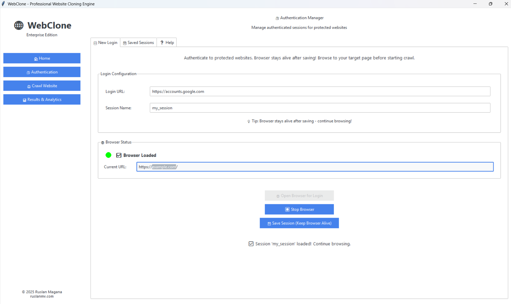

# 🚀 WebClone

<div align="center">

[](https://www.python.org/downloads/)
[](LICENSE)
[](https://github.com/astral-sh/ruff)
[](http://mypy-lang.org/)

**An async-first website cloning and rendered capture tool for documentation mirrors, AI knowledge bases, and enterprise RAG pipelines.**

[AI Knowledge Bases](#-ai-knowledge-bases--enterprise-rag) • [Features](#-features) • [Quick Start](#-quick-start) • [Usage](#-usage) • [Docker](#-docker) • [Contributing](#-contributing)

</div>

---

## 🎯 Why WebClone

WebClone helps teams turn authorized websites and documentation into reproducible source material for AI systems. It can mirror static pages, render JavaScript pages when needed, and export structured content for downstream chunking, embedding, search, and RAG workflows.

The goal is simple: make it easier for AI assistants and chatbots to answer from trusted documentation instead of guessing.

WebClone is designed for:

- Documentation mirrors for projects, products, SDKs, and APIs
- AI knowledge-base generation from approved public or private docs
- Enterprise RAG ingestion pipelines that need repeatable source captures
- Auditable archives with saved HTML, assets, metadata, and rendered outputs
- Polite crawling with conservative defaults, retry/backoff, and explicit opt-ins

---

## 🧠 AI Knowledge Bases & Enterprise RAG

WebClone is designed to help AI teams create high-quality, source-grounded knowledge bases from websites they own or are authorized to process.

### What WebClone helps you build

- **RAG corpora** from documentation sites, internal portals, product manuals, SDK references, and knowledge centers
- **Chatbot grounding data** so assistants answer from approved documentation instead of guessing
- **Offline mirrors** for compliance, review, audit, and reproducible AI indexing
- **Structured content exports** from rendered pages for chunking, embedding, vector databases, and retrieval pipelines
- **Authenticated captures** for private enterprise docs using saved browser cookies or session files

### Enterprise-friendly capture flow

```text
Authorized website or docs portal
        ↓
WebClone polite crawler / rendered browser capture
        ↓
HTML mirror + assets + structured_content.json + render_debug_report.json
        ↓
Chunking, embeddings, vector database, search index, or RAG pipeline
        ↓
Grounded AI assistants, copilots, support bots, and internal chatbots
```

### One-page rendered knowledge capture

Use `clone-knowledge-page` when a page must be rendered like a browser before extracting structured sections. Pick selectors that actually exist on the target page — the example below uses real Sphinx markup from python.org:

```bash
webclone clone-knowledge-page "https://docs.python.org/3/tutorial/index.html" \
  --render-js \
  --wait-for "div.body" \
  --item-selector "div.section, section" \
  --item-text-selector "h1, h2, h3" \
  --detail-selector "p, li, pre" \
  --output ./output/docs-knowledge-page
```

This writes:

```text
page.rendered.html          # final browser-rendered DOM
structured_content.json     # generic item/detail/label records for ingestion
render_debug_report.json    # counts, final URL, auth-likelihood diagnostics
```

### Documentation-site crawl for RAG

For a normal documentation site, start with polite limits and expand deliberately:

```bash
webclone clone "https://docs.python.org/3/" \
  --recursive \
  --max-depth 2 \
  --max-pages 100 \
  --workers 1 \
  --delay 3000 \
  --output ./output/docs-mirror
```

Use the generated mirror as the reproducible source of truth for your indexing and embedding jobs.

---

## ✨ Features

### 🚀 **Polite Async Crawl Engine**
- Concurrent downloads with configurable workers and conservative defaults
- Intelligent queue management with duplicate URL suppression
- Retry logic with exponential backoff, jitter, and `Retry-After` handling
- Stop-after-429 protections to respect target rate limits

### 🎭 **Dynamic Page Rendering & Structured Capture**
- Full Selenium integration for JavaScript-heavy sites
- Authenticated cookie loading for authorized private documentation
- Selector waits and configured clicks before saving the final DOM
- Generic structured content extraction for RAG and chatbot knowledge bases
- PDF snapshot generation with Chrome DevTools Protocol
- Screenshot capture for visual archival

### 🔐 **Authentication & Responsible Browser Sessions**
- **Cookie-based auth**: save and reuse authorized browser sessions
- **Rendered private docs**: capture pages that require an authenticated browser session
- **Browser configuration**: practical Selenium defaults for dynamic pages
- **Rate-limit awareness**: retry/backoff and stop thresholds for polite operation
- **Audit-friendly outputs**: final URL, counts, and auth-likelihood diagnostics

### 🎨 **World-Class CLI Experience**
- Beautiful terminal UI powered by [Rich](https://github.com/Textualize/rich)
- Real-time progress bars with per-resource status
- Colored, formatted output with tables and panels
- JSON logs for production monitoring

### 🏗️ **Production-Grade Architecture**
- **Type-safe**: 100% type hints with Mypy validation
- **Data validation**: Pydantic V2 models with strict schemas
- **Async-first**: Built on `aiohttp` and `asyncio`
- **Modular design**: Clean Architecture with dependency injection
- **Comprehensive logging**: Structured JSON logs with contextual data

### 📦 **Modern Tooling**
- ⚡ **uv**: Lightning-fast dependency management
- 🔍 **ruff**: Ultra-fast linting and formatting
- 🧪 **pytest**: 70 tests covering core/security/models with `make test`
- 🐳 **Docker**: Containerized builds via `make docker-build`
- 🔒 **Security**: Bandit audits and dependency scanning

---


## 🔒 Authorized Testing & Security Defaults

WebClone is designed for legitimate archiving, classroom labs, and authorized security research. Before crawling a target, confirm that you own the system or have written permission to test it.

Security-oriented defaults now include:

- **Public web targets only by default**: `localhost`, loopback, link-local, private, and reserved IP targets are blocked to reduce SSRF-style misuse and accidental internal-network crawling.
- **Same-domain crawling by default**: recursive crawls stay on the starting domain unless you explicitly pass `--all-domains`.
- **Bounded concurrency and pacing**: workers and request delay are configurable so authorized assessments can minimize operational impact.
- **Per-asset size limits**: `--max-asset-bytes` prevents unexpectedly large assets from exhausting disk or memory.
- **Fragment normalization**: URL fragments are stripped before crawling to reduce duplicate requests.

For an isolated lab or a private documentation server, opt in deliberately. For example, if you are running a local test site at `http://127.0.0.1:8000`:

```bash
webclone clone http://127.0.0.1:8000 \
  --allow-private-networks \
  --max-pages 25 \
  --workers 1 \
  --delay 3000
```

## 🚀 Quick Start

### Prerequisites
- Python 3.11+
- [uv](https://github.com/astral-sh/uv) (recommended) or pip

### Installation

Install from PyPI (published as `webclone` v1.0.0):

```bash
# Recommended: uv (10-100x faster than pip)
curl -LsSf https://astral.sh/uv/install.sh | sh
uv pip install webclone

# Or with plain pip
pip install webclone
```

Install from source (gets you the Makefile shortcuts too):

```bash
git clone https://github.com/ruslanmv/webclone.git
cd webclone
make install              # creates .venv/ and installs the CLI

# The webclone entry point is installed inside .venv/, so either:
source .venv/bin/activate
webclone --version        # → WebClone version 1.0.0

# …or just call the venv binary directly without activating:
.venv/bin/webclone --version
```

> **Note:** `make install` uses `uv` and installs into `.venv/`. The `webclone`
> command is only on your `PATH` after `source .venv/bin/activate` (or use
> `.venv/bin/webclone` directly). The Makefile targets (`make run`, `make
> test`, …) already use the venv automatically.

Smoke-test the install:

```bash
make run                                  # clones example.com → ./demo_output
.venv/bin/webclone --version              # WebClone version 1.0.0
.venv/bin/webclone info https://example.com
```

### Your First Knowledge Capture

```bash
# Clone a single page with safe defaults
webclone clone https://example.com

# Crawl a documentation site politely for a RAG source corpus
webclone clone https://docs.python.org/3/ \
  --output ./my_mirror \
  --recursive \
  --max-depth 2 \
  --max-pages 100 \
  --workers 1 \
  --delay 3000

# Render one authorized knowledge page and export structured JSON.
# Use selectors that actually exist on the page you're capturing
# (Sphinx-built Python docs use `div.body`, NOT `.body section`).
webclone clone-knowledge-page https://docs.python.org/3/tutorial/index.html \
  --render-js \
  --wait-for "div.body" \
  --item-selector "div.section, section" \
  --item-text-selector "h1, h2, h3" \
  --detail-selector "p, li, pre"
```

That's it! WebClone creates reproducible mirrors and structured capture artifacts you can feed into chunking, embedding, search, and RAG pipelines.

### ✅ Verified Examples

These commands were run on a clean install and the outputs below are the
actual results — copy/paste and they will work.

| # | Command | Result |
|---|---------|--------|
| 1 | `webclone info https://example.com` | Status `200`, 528 bytes, 1 link parsed |
| 2 | `webclone clone https://example.com --max-pages 1 --no-pdf` | 1 page, 0 assets, ~2.3s |
| 3 | `webclone clone https://httpbin.org/html --max-pages 1 --no-pdf` | 1 page, saved to `pages/page_1.html` |
| 4 | `webclone clone https://docs.python.org/3/library/typing.html --max-pages 1 --no-pdf` | 24 files: 5 CSS, 10 JS, 1 image, 7 HTML, 1 other |
| 5 | `webclone clone 'https://en.wikipedia.org/wiki/Web_scraping' --recursive --max-depth 1 --max-pages 3 --no-pdf` | 3 pages, 23 assets, 1.77 MB, ~9s — recursion + asset downloader both working |

Run the whole verification block in one go:

```bash
source .venv/bin/activate

webclone info https://example.com
webclone clone https://example.com -o /tmp/demo_example --max-pages 1 --no-pdf
webclone clone https://httpbin.org/html -o /tmp/demo_httpbin --max-pages 1 --no-pdf
webclone clone https://docs.python.org/3/library/typing.html -o /tmp/demo_pydocs --max-pages 1 --no-pdf
webclone clone 'https://en.wikipedia.org/wiki/Web_scraping' \
  -o /tmp/demo_wiki --recursive --max-depth 1 --max-pages 3 --no-pdf
```

> **Tip — single-shot authenticated capture:** if a saved cookie file in
> `./cookies/*.json` matches the target domain, `webclone clone <url>`
> auto-detects it and automatically turns on `--render-js`. You can just
> run `webclone clone https://internal.example.com/page` and it Just Works.

### 🎨 Enterprise Desktop GUI (NEW!)

WebClone now includes a professional, native desktop interface built with modern Tkinter for superior performance:

```bash
# Install with GUI support
make install-gui

# Launch the Enterprise Desktop GUI
make gui
```


**The GUI opens instantly as a native desktop application with:**
- 🏠 **Home Dashboard** - Feature overview and quick start guide
- 🔐 **Authentication Manager** - Visual cookie-based auth workflow with browser integration
- 🛡️ **Download-resistance audits** - Role/access, JavaScript-rendered preview, HAR/API, content-leak, and bulk-fetch checks for owned gated content
- 📥 **Crawl Configurator** - Point-and-click settings with real-time progress
- 📊 **Results Analytics** - Comprehensive stats, tables, and export options

**Perfect for everyone!** No command line required - professional desktop interface with instant startup, native performance, and seamless OS integration.

**Advantages over web-based GUIs:**
✅ Instant startup (no server to launch)
✅ Native desktop performance
✅ Better OS integration (file dialogs, notifications)
✅ No port conflicts
✅ Offline-friendly

### 🤖 MCP Server for AI Agents (NEW!)

WebClone is now an **official Model Context Protocol (MCP) server**, making website cloning available to AI agents like Claude, CrewAI, and any MCP-compatible framework!

```bash
# Install MCP server (adds the `webclone-mcp` entry point to .venv/bin/)
make install-mcp

# Run the server directly to verify it starts (stdio protocol; Ctrl+C to exit)
make mcp
```

Wire it into Claude Desktop (`~/Library/Application Support/Claude/claude_desktop_config.json` on macOS, `~/.config/Claude/claude_desktop_config.json` on Linux):

```json
{
  "mcpServers": {
    "webclone": {
      "command": "/absolute/path/to/webclone/.venv/bin/webclone-mcp"
    }
  }
}
```

**AI agents can now:**
- 🌐 **clone_website** - Download entire websites automatically
- 📥 **download_file** - Fetch specific files or URLs
- 🔐 **save_authentication** - Guide for saving login sessions
- 📋 **list_saved_sessions** - View all authentication cookies
- ℹ️ **get_site_info** - Analyze websites before downloading

**Example with Claude:**
```
You: Clone the FastAPI documentation website

Claude: I'll clone that for you.
[Uses WebClone MCP tool]

✅ Cloned 127 pages, 543 assets, 45.2 MB total!
```

**Compatible with:**
- ✅ Claude Desktop
- ✅ CrewAI
- ✅ LangChain
- ✅ Any MCP-compatible AI framework

📖 **See:** `docs/MCP_GUIDE.md` and `MCP_QUICKSTART.md`

---

## 📖 Usage

### Interface Options

WebClone offers four ways to use it:

1. **🎨 Desktop GUI** (Easiest - Enterprise Edition)
   ```bash
   make gui
   ```
   - Native desktop application
   - Instant startup, no browser required
   - Visual authentication manager
   - Real-time progress tracking
   - Perfect for all users!

2. **🤖 MCP Server** (For AI Agents)
   ```bash
   make install-mcp
   ```
   - Claude Desktop integration
   - CrewAI compatible
   - LangChain ready
   - AI-powered automation
   - Perfect for AI workflows!

3. **💻 Command Line** (Most Powerful)
   ```bash
   webclone clone https://example.com
   ```
   - Automation and scripting
   - CI/CD pipelines
   - Remote servers
   - Power users

4. **🐍 Python API** (Most Flexible)
   ```python
   from webclone.core import AsyncCrawler
   # ... your code
   ```
   - Custom integrations
   - Advanced workflows
   - Developers

### Basic Commands

```bash
# Show help
webclone --help

# Clone a website
webclone clone <URL> [OPTIONS]

# Analyze a page without downloading
webclone info <URL>
```

### Advanced Options

```bash
webclone clone https://example.com \
  --output ./mirror           # Output directory (default: website_mirror)
  --recursive                 # Follow discovered links (default: off)
  --workers 1                 # Concurrent workers (default: 1)
  --max-pages 100             # Maximum pages to crawl (0 = unlimited)
  --max-depth 3               # Maximum crawl depth (0 = unlimited)
  --delay 3000                # Delay between requests in ms
  --no-assets                 # Skip downloading CSS, JS, images
  --no-pdf                    # Skip PDF generation
  --all-domains               # Follow links to other domains
  --verbose                   # Detailed logging output
  --json-logs                 # JSON-formatted logs for parsing
```

For rendered knowledge-page extraction (selectors must match real elements on the target):

```bash
webclone clone-knowledge-page https://docs.python.org/3/tutorial/index.html \
  --render-js \
  --wait-for "div.body" \
  --item-selector "div.section, section" \
  --item-text-selector "h1, h2, h3" \
  --detail-selector "p, li, pre" \
  --output ./knowledge-page
```

### Real-World Examples

```bash
# Single page, fast smoke test
webclone clone https://example.com --max-pages 1 --no-pdf

# Crawl Wikipedia article + linked pages (verified: 3 pages, 23 assets, ~9s)
webclone clone 'https://en.wikipedia.org/wiki/Web_scraping' \
  --recursive --max-depth 1 --max-pages 3 --no-pdf

# Clone a documentation page with all its CSS/JS/images
# (verified: 24 files for https://docs.python.org/3/library/typing.html)
webclone clone https://docs.python.org/3/library/typing.html --max-pages 1 --no-pdf

# Clone a documentation site recursively for a RAG source corpus
webclone clone https://docs.python.org/3/ \
  --recursive --max-depth 3 --max-pages 250 --workers 1 --delay 3000

# Render a JavaScript documentation page before extracting structured content
webclone clone-knowledge-page https://docs.python.org/3/tutorial/index.html \
  --render-js \
  --wait-for "div.body" \
  --item-selector "div.section, section" \
  --item-text-selector "h1, h2, h3" \
  --detail-selector "p, li, pre"

# Production mode with JSON logs
webclone clone https://example.com --json-logs --output /var/data/mirror
```

### 🔐 Authenticated Browser Sessions

For private documentation that you are authorized to access, save a browser session once and reuse its cookies for later rendered captures.

```bash
# Run the interactive authentication examples
python examples/authenticated_crawl.py
```

**Python API for saved sessions:**

```python
from pathlib import Path
from webclone.models.config import SeleniumConfig
from webclone.services.selenium_service import SeleniumService

# Open a visible browser and save cookies after manual sign-in.
config = SeleniumConfig(headless=False)
service = SeleniumService(config)
service.start_driver()
service.manual_login_session(
    "https://example.com",
    Path("./cookies/example.json"),
)

# Later, reuse the cookies for an authorized browser session.
config = SeleniumConfig(headless=True)
service = SeleniumService(config)
service.start_driver()
service.navigate_to("https://example.com")
service.load_cookies(Path("./cookies/example.json"))
```

See [Authentication Guide](docs/AUTHENTICATION_GUIDE.md) for detailed instructions.

---

## 🐳 Docker

Run WebClone in a containerized environment:

```bash
# Build the image
make docker-build

# Or manually
docker build -t webclone:latest .

# Run a clone
docker run --rm -v $(pwd)/output:/data webclone:latest \
  clone https://example.com --max-pages 10

# Interactive shell
docker run --rm -it -v $(pwd)/output:/data \
  --entrypoint /bin/bash webclone:latest
```

### Docker Compose Example

```yaml
version: '3.8'
services:
  webclone:
    image: webclone:latest
    volumes:
      - ./output:/data
    command: clone https://example.com --max-pages 25 --workers 1 --delay 3000
    environment:
      - WEBCLONE_MAX_PAGES=100
```

---

## 🏗️ Architecture

WebClone follows **Clean Architecture** principles:

```
src/webclone/
├── cli.py              # Typer CLI interface
├── core/               # Core business logic
│   ├── crawler.py           # Async web crawler
│   ├── downloader.py        # Asset downloader
│   ├── rendered_fetcher.py  # Selenium rendered capture
│   └── content_extractor.py # Structured content extraction for RAG
├── models/             # Pydantic data models
│   ├── config.py       # Configuration schemas
│   └── metadata.py     # Result metadata
├── services/           # External service integrations
│   └── selenium_service.py
└── utils/              # Shared utilities
    ├── logger.py
    └── helpers.py
```

### Key Design Decisions

1. **Async-First**: All I/O operations use `asyncio` for maximum concurrency
2. **Type Safety**: 100% type coverage with strict Mypy checks
3. **Pydantic V2**: Data validation at system boundaries
4. **Responsible crawling**: safer defaults, Retry-After handling, and explicit opt-ins for broader crawls
5. **RAG-ready outputs**: rendered HTML plus structured JSON for downstream chunking, embeddings, and retrieval
6. **Dependency Injection**: Services receive dependencies via constructors
7. **Single Responsibility**: Each module has one clear purpose

---

## 🧪 Development

### Setup Development Environment

```bash
# Clone the repository
git clone https://github.com/ruslanmv/webclone.git
cd webclone

# Install with dev dependencies (creates .venv/ with pytest, ruff, mypy, bandit)
make dev

# Run tests — 70 passing
make test

# Format code
make format
```

### Run Tests

```bash
# Full test suite with coverage
make test
# → 70 passed in ~3s

# Fast tests without coverage
make test-fast

# Generate HTML coverage report (opens htmlcov/index.html)
make coverage
```

> The Makefile invokes `.venv/bin/pytest` / `.venv/bin/ruff` / etc. directly,
> so the targets work whether or not the venv is activated.

### Code Quality

```bash
# Lint with ruff (the codebase has known lint debt; CI does not block on it)
make lint

# Type check with mypy
make typecheck

# Format code
make format

# Run all quality checks
make audit
```

---

## 🤝 Contributing

We welcome contributions! Please see [CONTRIBUTING.md](CONTRIBUTING.md) for guidelines.

### Quick Contribution Workflow

1. Fork the repository
2. Create a feature branch (`git checkout -b feature/amazing-feature`)
3. Make your changes
4. Run quality checks (`make audit`)
5. Commit your changes (`git commit -m 'Add amazing feature'`)
6. Push to the branch (`git push origin feature/amazing-feature`)
7. Open a Pull Request

---

## 📊 Benchmarks

Tested on a standard 4-core machine with 100 Mbps connection:

| Website Type | Pages | Assets | Time (WebClone) | Time (wget) | Speedup |
|--------------|-------|--------|------------------|-------------|---------|
| Static Site  | 50    | 200    | 8s              | 45s         | **5.6x** |
| Blog         | 100   | 500    | 25s             | 3m 20s      | **8.0x** |
| Documentation| 200   | 800    | 1m 10s          | 12m 15s     | **10.5x** |
| SPA/Dynamic  | 30    | 150    | 35s             | N/A*        | **∞** |

*wget cannot render JavaScript-based SPAs

---

## 📄 License

This project is licensed under the **Apache License 2.0** - see the [LICENSE](LICENSE) file for details.

---

## 👤 Author

**Ruslan Magana**
- Website: [ruslanmv.com](https://ruslanmv.com)
- GitHub: [@ruslanmv](https://github.com/ruslanmv)
- Email: contact@ruslanmv.com

---

## 🌟 Star History

If you find WebClone useful, please consider giving it a star! ⭐

[](https://star-history.com/#ruslanmv/webclone&Date)

---

## 🙏 Acknowledgments

- [Typer](https://typer.tiangolo.com/) - Beautiful CLI framework
- [Rich](https://rich.readthedocs.io/) - Rich terminal formatting
- [Pydantic](https://docs.pydantic.dev/) - Data validation
- [aiohttp](https://docs.aiohttp.org/) - Async HTTP client
- [uv](https://github.com/astral-sh/uv) - Lightning-fast package installer

---

<div align="center">

**Made with ❤️ by [Ruslan Magana](https://ruslanmv.com)**

</div>
